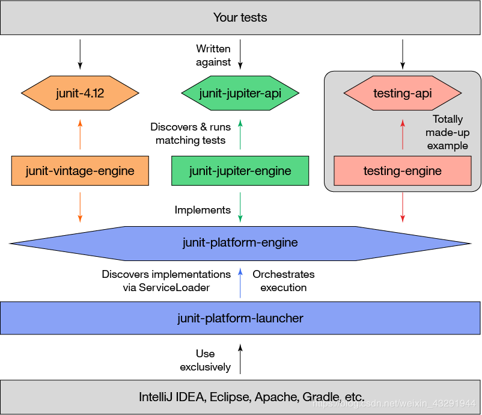

# Junit5
Junit5 由JUnit Platform + JUnit Jupiter + JUnit Vintage3部分构成，借用 IBM Developer 的一张图来说明 JUnit 5 的架构：

### JUnit Platform:
其主要作用是在JVM上启动测试框架。它定义了一个抽象的TestEngine API来定义运行在平台上的测试框架；也就是说其他的自动化测试引擎或开发人员自己定制的引擎都可以接入Junit实现对接和执行。同时还支持通过命令行、Gradle和Maven来运行平台（这对于我们做自动化测试至关重要）。  
### JUnit Jupiter:
这是Junit5的核心，可以看作是承载Junit4原有功能的演进，包含了JUnit 5最新的编程模型和扩展机制；很多丰富的新特性使JUnit自动化测试更加方便、功能更加丰富和强大。也是测试需要重点学习的地方；Jupiter本身也是一个基于Junit Platform的引擎实现，对JUnit 5而言，JUnit Jupiter API只是另一个API！。
### JUnit Vintage:
Junit发展了10数年，Junit 3和 Junit 4都积累了大量的用户，作为新一代框架，这个模块是对JUnit3，JUnit4 版本兼容的测试引擎，使旧版本junit的自动化测试脚本也可以顺畅运行在Junit5下，它也可以看作是基于Junit Platform实现的引擎范例。

JUnit 5 对 Java 运行环境的最低要求是 Java 8。

## Junit5 的新特性
- 嵌套单元测试
- Lambda支持
- 参数化测试
- 重复测试
- 动态测试

### JUnit 4 与 JUnit 5 中的注解比较
|Junit5|JUnit4         |说明                 |
|-------|-------------|---------------------|
|@Test |@Test   |被注解的方法是一个测试方法 |
|@BeforeAll |@BeforeClass| 被注解的（静态）方法将在当前类中的所有@Test方法**前**执行一次 |
|@BeforeEach |@Before  | 被注解的方法将在当前类中的每个@Test方法**前**执行 |
|@AfterEach |@After| 被注解的方法将在当前类中的每个@Test方法**后**执行 |
|@AfterAll | @AfterClass| 被注解的（静态）方法将在当前类中的所有@Test方法**后**执行一次 |
|@Disabled | @Ignore| 被注解的方法不会执行（将被跳过），但会告知为已执行 |

### Junit5常用注解
|注解|说明|
|---|---|
|@Test|表明一个测试方法|
|@DisplayName|测试类或方法的显示名称|
|@BeforeEach|表明在单个测试方法运行之前执行的方法|
|@AfterEach|表明在单个测试方法运行之后执行的方法|
|@BeforeAll|表明在所有测试方法之前执行的方法|
|@AfterAll|表明在所有测试方法之后执行的方法|
|@Disabled|禁用测试类或方法|
|@Tag|为测试类或方法添加标签|
|@RepeatedTest|额外重复执行|
|@Nested|嵌套执行|