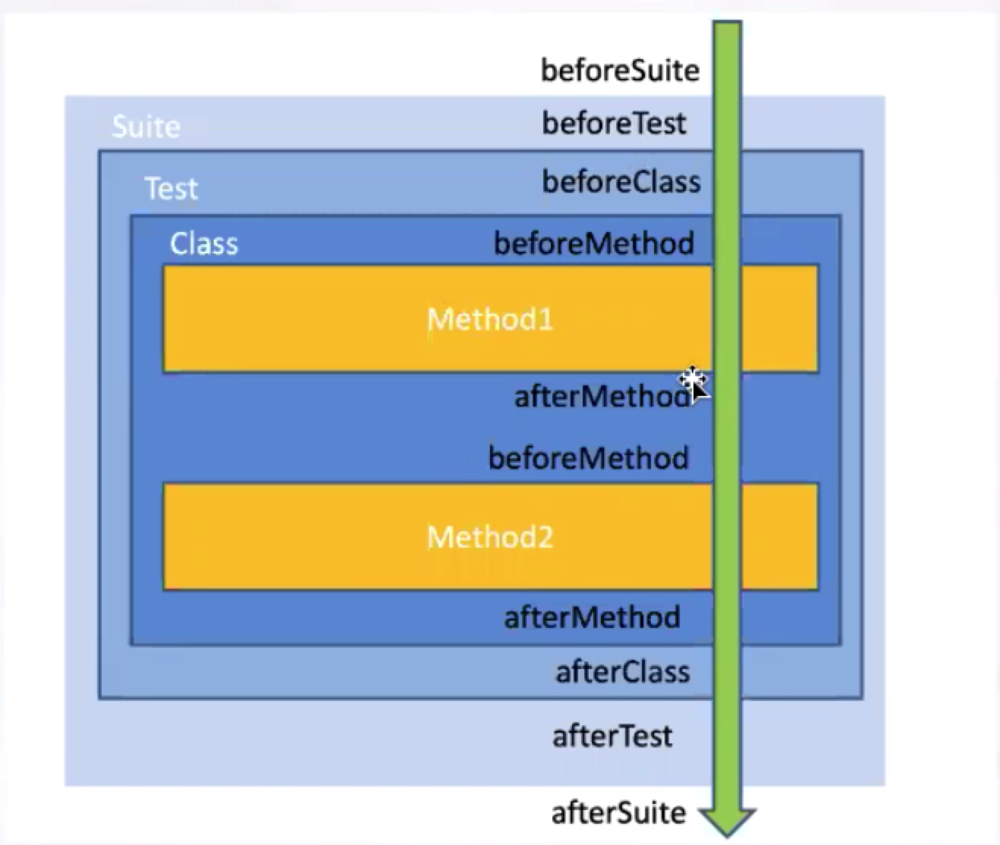

# TestNG
[TestNG官方文档](https://testng.org/doc/index.html)

## 什么是TestNG

**TestNG**是一个测试框架，其灵感来自JUnit和NUnit，但引入了一些新的功能，使其功能更强大，使用更方便。

TestNG是一个开源自动化测试框架;TestNG表示**下一代**(**N**ext **G**eneration的首字母)。 TestNG类似于JUnit(特别是JUnit 4)，但它不是JUnit框架的扩展。它的灵感来源于JUnit。它的目的是优于JUnit，尤其是在用于测试集成多类时。 TestNG的创始人是**Cedric Beust**(塞德里克·博伊斯特)。

TestNG消除了大部分的旧框架的限制，使开发人员能够编写更加灵活和强大的测试。 因为它在很大程度上借鉴了Java注解(JDK5.0引入的)来定义测试，它也可以显示如何使用这个新功能在真实的Java语言生产环境中。

## TestNG特点

- 注解
- TestNG使用Java和面向对象的功能
- 支持综合类测试(例如，默认情况下，不用创建一个新的测试每个测试方法的类的实例)
- 独立的编译时测试代码和运行时配置/数据信息
- 灵活的运行时配置
- 主要介绍“测试组”。当编译测试，只要要求`TestNG`运行所有的“前端”的测试，或“快”，“慢”，“数据库”等
- 支持依赖测试方法，并行测试，负载测试，局部故障
- 灵活的插件API
- 支持多线程测试

## TestNG注解

| 注解          | 描述                                                         |
| ------------- | ------------------------------------------------------------ |
| @BeforeSuite  | 在该套件的所有测试都运行在注释的方法之前，仅运行一次。       |
| @AfterSuite   | 在该套件的所有测试都运行在注释方法之后，仅运行一次。         |
| @BeforeClass  | 在调用当前类的第一个测试方法之前运行，注释方法仅运行一次。   |
| @AfterClass   | 在调用当前类的第一个测试方法之后运行，注释方法仅运行一次     |
| @BeforeTest   | 注释的方法将在属于@Test注解的类的所有测试方法运行之前运行。  |
| @AfterTest    | 注释的方法将在属于@Test注解的类的所有测试方法运行之后运行。  |
| @BeforeGroups | 配置方法将在之前运行组列表。 此方法保证在调用属于这些组中的任何一个的第一个测试方法之前不久运行。 |
| @AfterGroups  | 此配置方法将在之后运行组列表。该方法保证在调用属于任何这些组的最后一个测试方法之后不久运行。 |
| @BeforeMethod | 注释方法将在每个测试方法之前运行。                           |
| @AfterMethod  | 注释方法将在每个测试方法之后运行。                           |
| @DataProvider | 标记一种方法来提供测试方法的数据。 注释方法必须返回一个`Object[][]`，其中每个Object[]可以被分配给测试方法的参数列表。 要从该DataProvider接收数据的@Test方法需要使用与此注释名称相等的dataProvider名称。 |
| @Factory      | 将一个方法标记为工厂，返回TestNG将被用作测试类的对象。 该方法必须返回Object [] |
| @Listeners    | 定义测试类上的侦听器。                                       |
| @Parameters   | 描述如何将参数传递给`@Test`方法。                            |
| @Test         | 将类或方法标记为测试的一部分。                               |

### TestNG执行流程

### TestNG忽略测试
有时候我们只想运行部分测试用例，在这种情况下，@Test(enabled=fasle)有助于禁用某些测试用例。被标注的测试用例将不会被执行，此参数默认值为true。

### TestNG组控制问题
在TestNG中，组groups的概念主要是相对于测试方法而言的，即，将具有相似功能的测试方法分组，这样在定义测试用例的时候就可以以组为单位加入对应的测试方法。一个测试方法可以属于组，也可以属于多个组。

### TestNG依赖控制
通过dependsOnMethods声明被依赖方法，该方法将在被依赖方法成功执行后，才会执行，假如被依赖方法执行失败，则该方法会被跳过

### TestNG多线程
测试方法是通过在@Test注解中配置threadPoolSize这个属性来进入多线程模式的。

|属性|描述|
|---|----|
|invocationCount|表示执行的次数|
|threadPoolSize|表示线程池的内线程的个数|
|timeOut|超时时间-毫秒|

threadPoolSize被设为3，这就说明了该测试方法将会在三个不同的线程中同时执行；invocationCount配置的是该测试方法应被执行的总次数；timeOut配置的是每次执行该测试方法所耗费时间，超过则测试失败

### TestNG参数化
需要传递复杂参数，或者参数需要从Java中创建（如复杂对象，从属性文件或这数据库中读取对象），可以使用Data Provider来给需要的测试提供参数。所谓数据提供者，就是一个能返回对象数组的方法，并且这个方法被@Data Provider注解标注